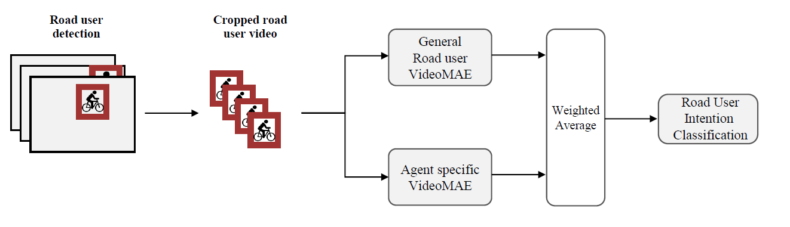

# Video-based Road User Intention Recognition 
Repository with the code and road user intention labels (also the subset of the human experiment benchmark) for the ECCV paper #1628

## Datasets
ROAD / Oxford: https://github.com/gurkirt/road-dataset
ROAD++ / Waymo: https://github.com/salmank255/Road-waymo-dataset

## Attribution
The RUIR extension of the ROAD and ROAD++ dataset was made using the ROAD++ and ROAD datasets.

ROAD++ dataset was made using the Waymo Open Dataset, provided by Waymo LLC under license terms available at waymo.com/open.

By downloading or using the ROAD++ dataset and/or the Waymo Open Dataset, you are agreeing to the terms of the Waymo Open Dataset License Agreement for Non-Commercial Use—which includes a requirement that you only use the Waymo Open Dataset (or datasets built from it, such as the ROAD++ dataset) for noncommercial purposes. “Non-commercial Purposes" means research, teaching, scientific publication and personal experimentation. Non-commercial Purposes include use of the dataset to perform benchmarking for purposes of academic or applied research publication. Non-commercial Purposes does not include purposes primarily intended for or directed towards commercial advantage or monetary compensation, or purposes intended for or directed towards litigation, licensing, or enforcement, even in part.

ROAD dataset is build upon Oxford Robot Car Dataset (OxRD). Similar to the original dataset (OxRD), the ROAD dataset is licensed under a Creative Commons Attribution-NonCommercial-ShareAlike 4.0 International License and is intended for non-commercial academic use. If you are interested in using the dataset for commercial purposes, please contact original creator OxRD for video content and Fabio and Gurkirt for event annotations.

## Trained models
Todo:
[ ] upload agent and general models

## Example training:
`python run.py [--arguments]` 
